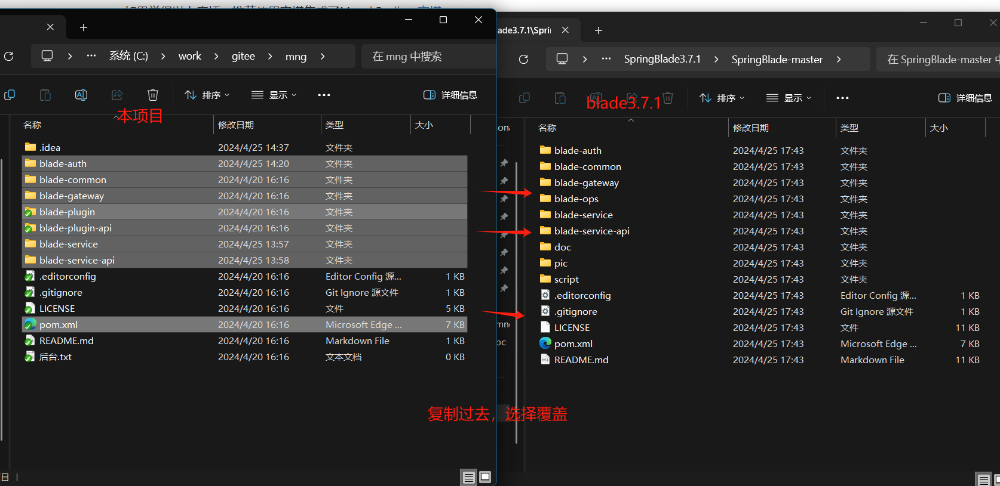
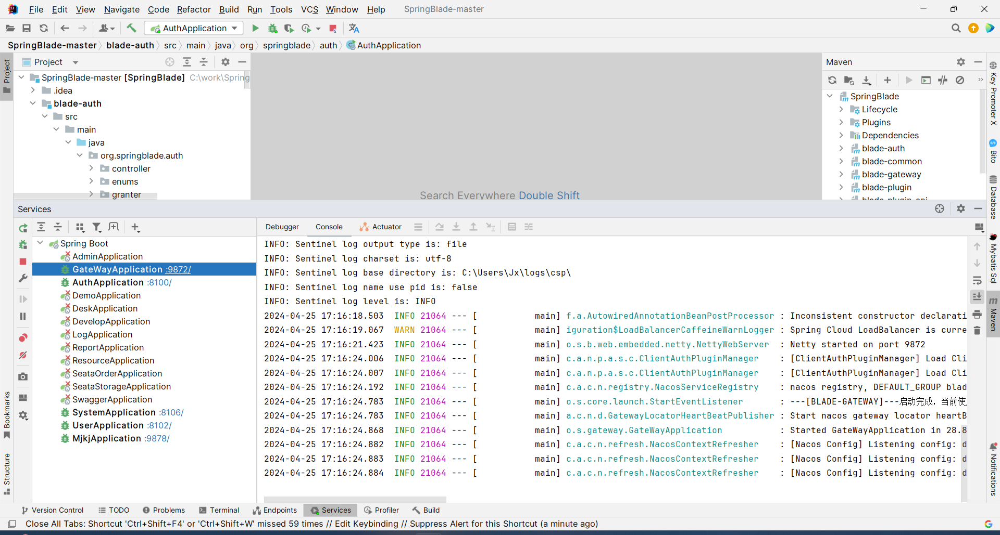
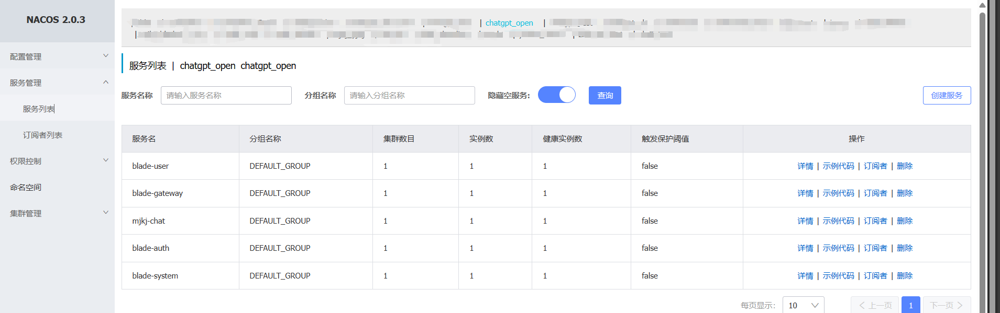
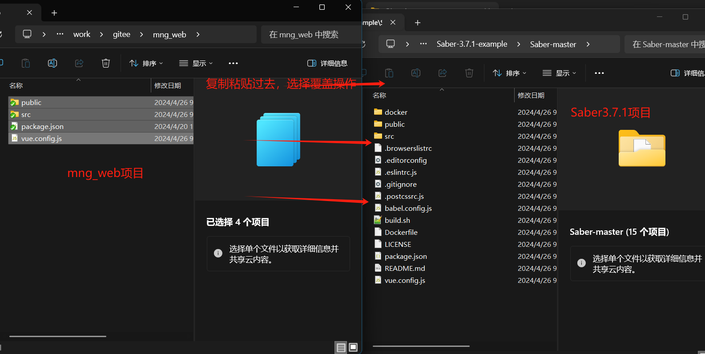
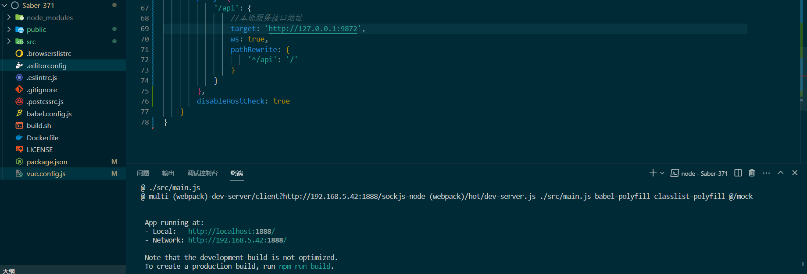
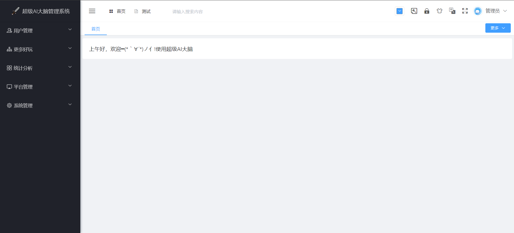

<p align="center">
	
</p>

```
🕙 分享是一种美德，右上随手点个 🌟 Star，谢谢
```

**温馨提醒**

1. 亲，动动您发财的手为我们点一颗star，是对我们最好的鼓励和支持，也是我们前进的动力<br/>
2. 本项目是一个微服务全栈项目，认真刻苦的掌握它，你会对微服务有深刻理解<br/>
3. 发现有问题？添加下方微信客服一起探讨，或者直接提Issues<br/>
4. 演示环境<br/>

　　　　[前端：http://www.mj.ink](http://www.mj.ink)

　　　　[后端：http://gpt.ht.mj.ink:8899](http://gpt.ht.mj.ink:8899)

　　　　[技术社区 http://doc.mj.ink](http://doc.mj.ink)

　　　　[MidJourney API接口文档](http://open.mj.ink/index/xqView?ID=1793092044168437761)

5. 视频教程

   |                         后端启动教程                         |                       后端界面启动教程                       |                         PC端启动教程                         |
   | :----------------------------------------------------------: | :----------------------------------------------------------: | :----------------------------------------------------------: |
   | <a target="_blank" href="https://www.bilibili.com/video/BV1rf421m7Jn/"> </a> | <a target="_blank" href="https://www.bilibili.com/video/BV1Qz42117uJ/"></a> | <a target="_blank" href="https://www.bilibili.com/video/BV1cH4y137XZ"></a> |


6. 本项目不在任何平台出售,如有发现请积极举报<br/>


## 超级AI大脑产品架构图


## 项目关系

| 项目                                                         | Star                                                         | 简介                         |
| ------------------------------------------------------------ | ------------------------------------------------------------ | ---------------------------- |
| [springboot-openai-chatgpt](https://gitee.com/ylzl/springboot-openai-chatgpt)  | [](https://gitee.com/ylzl/springboot-openai-chatgpt)       | 基于 Spring Boot 单体架构        |
| [springcloud-openai-chatgpt](https://gitee.com/ylzl/springcloud-openai-chatgpt)      | [](https://gitee.com/ylzl/springcloud-openai-chatgpt)               | 基于 Spring Cloud 微服务架构       |
| [springboot-openai-chatgpt](https://github.com/274056675/springboot-openai-chatgpt)  |  [](https://github.com/274056675/springboot-openai-chatgpt)       | 基于 Spring Boot 单体架构        |
| [springcloud-openai-chatgpt](https://github.com/274056675/springcloud-openai-chatgpt)      | [](https://github.com/274056675/springcloud-openai-chatgpt)               | 基于 Spring Cloud 微服务架构       |
| [springboot-openai-chatgpt](https://gitcode.com/ElonMusk666/springboot-openai-chatgpt) | [](https://gitcode.com/ElonMusk666/springboot-openai-chatgpt) | 基于 Spring Boot 单体架构 |


###### 温馨提示：

[本项目基于Bladex开源版本3.7.1.RELEASE开发](https://gitee.com/smallc/SpringBlade)

## 演示环境

　　　　[后端：http://gpt.ht.mj.ink:8899](http://gpt.ht.mj.ink:8899)

　　　　[前端：http://www.mj.ink](http://www.mj.ink)
## 在线体验

1. Web端在线体验地址(点击图片可访问)：http://www.mj.ink

     <a href="http://www.mj.ink"></a>

2. 微信关注超级AI大脑公众号及手机扫码下载App

|                          微信公众号                          |                           Android                            |                             IOS                              |
| :----------------------------------------------------------: | :----------------------------------------------------------: | :----------------------------------------------------------: |
|  |  | <a href="https://apps.apple.com/cn/app/id6448979172"></a> |
|                        **微信公众号**                        |                         **Android**                          |                           **IOS**                            |

3. 新用户第一次登录即为注册，可微信进行登录。如图：

 <div align=left>
    <td ></td>
 </div>


## 1.项目简介

​      **本git地址为超级AI大脑的开源代码地址，可下载运行。超级AI大脑已经上线，PC端和APP端都可以体验完整的功能。欢迎使用!** 超级AI大脑使用gpt技术，能快速生成语言内容，例如文案、情书和题目。用户只需输入关键词，可提高工作效率和创造力。超级AI大脑能够结合gpt的强大的问答系统和知识图谱，为用户提供全面、准确的答案。不仅能够回答简单问题，还能够针对复杂的问题给出详细的解答。问超级AI大脑支持编程全能，利用gpt生成代码，帮助用户减少编程工作量。此外，超级AI大脑能随着地球数据增长不断强化自身能力，提供更优秀的智能应用。

### 1.1App前台展示

<table>
    <tr>
        <td></td>
       	<td></td>
        <td></td>
        <td></td>
    </tr>
</table>

### 1.2PC端界面展示

###### 聊天页


###### 绘画广场


###### PC端绘画界面


###### PC端绘画生成


## 2.主要功能点展示

### 2.1 AI聊天工具箱

在AI大脑的首页界面，有可以看到AI大脑提供的工具按钮，AI大脑提供了人工智能在人们生活中的不同场景下的应用工具，工具板块可大致分为教师、百科、生活、娱乐等领域，每个领域下面还会有不同的划分。功能如图所示：

<table>
    <tr>
        <td></td>
        <td></td>
        <td></td>
    </tr>
</table>

### 2.2 AI绘图

**AI大脑软件中的绘图板块是一项非常吸引人和有趣的功能。它使用了高级人工智能技术，让用户能够轻松地将他们的想象力转化为艺术品。绘图板块为用户提供了丰富的实用功能，用户可基于功能随心所欲生成您想要的各种各样的图片,如果您有创意，那么AI绘画将是您很好的创意实现工具！**

绘图板块分为创作、社区、我的，下面对绘图板块三部分分别展开进行介绍:

**创作部分**，用户可基于文字描述生成图片或者基于用户上传的图片再根据用户选择的图片风格生成类似的图片。用户基于文生图时，用户可输入文字描述、选择图片比例、图片生成数量、AI大脑提供的不同类别风格为用户生成精美的图片。功能展示如图：

<table>
    <tr>
        <td></td>
        <td></td>
        <td></td>
        <td></td>
    </tr>
</table>
**社区部分**，用户发布的作品将在社区中根据作品热度进行排序展示，用户可点击进行观赏、创作同款、生成海报，用户点击分享可下载图片以及分享到朋友圈。功能展示如图：

<table>
    <tr>
        <td></td>
        <td></td>
        <td></td>
        <td></td>
        </tr>
    </table>


**我的部分**，用户可在此部分进行签到获取积分以及查看历史作品、发布作品、点赞作品等

### 2.3 AI画廊展馆

```html
P1分类：通用   风格：自定义   比例：1:1   尺寸：512*512   生成数量：3张
文字描述：杰作 高质量 少女
```

<table align="center">
    <tr>
        <td height="220" width="210"></td>
        <td height="220" width="210"></td>
        <td height="220" width="210"></td>
    </tr>
</table>


```
P2分类：通用   风格：自定义   比例：1:1   尺寸：512*512   生成数量：3张
文字描述：卡通少女
```

<table align="center">
    <tr>
        <td height="220" width="210"></td>
        <td height="220" width="210"></td>
        <td height="220" width="210"></td>
    </tr>
</table>


```
P3分类：通用   风格：漫画   比例：1:1   尺寸：512*512   生成数量：3张
文字描述：卡通猫咪
```

<table align="center">
    <tr>
        <td height="220" width="210"></td>
        <td height="220" width="210"></td>
        <td height="220" width="210"></td>
    </tr>
</table>


```
P4分类：通用   风格：写实主义   比例：1:1   尺寸：512*512   生成数量：3张
文字描述：鲜花
```

<table align="center">
    <tr>
        <td height="220" width="210"></td>
        <td height="220" width="210"></td>
        <td height="220" width="210"></td>
    </tr>
</table>


```
P5分类：中国风   风格：国画   比例：1:1   尺寸：512*512   生成数量：3张
文字描述：中国山水画
```

<table align="center">
    <tr>
        <td height="220" width="210"></td>
        <td height="220" width="210"></td>
        <td height="220" width="210"></td>
    </tr>
</table>


```
P6分类：场景   风格：史诗大片   比例：1:1   尺寸：512*512   生成数量：3张
文字描述：机器人
```

<table align="center">
    <tr>
        <td height="220" width="210"></td>
        <td height="220" width="210"></td>
        <td height="220" width="210"></td>
    </tr>
</table>


```
P7分类：场景  风格：赛博朋克   比例：1:1   尺寸：512*512  
文字描述：赛博朋克世界的人
```

<table align="center">
    <tr>
        <td height="220" width="210"></td>
        <td height="220" width="210"></td>
        <td height="220" width="210"></td>
    </tr>
</table>


### 2.4后台数据

<table>
    <tr>
        <td ></td>
    </tr>
</table>

### 2.5后台展示

用户管理、微信机器人、商品管理、更多好玩管理

<table>
    <tr>
        <td ></td>
    </tr>
    <tr>
        <td ></td>
    </tr>
    <tr>
        <td ></td>
    </tr>
    <tr>
        <td ></td>
    </tr>
</table>

## 3.低代码开发平台

**使用本系统的朋友们，在这里需要重点提及一下，在后台里的研发模块为MJ科技提供的一个低代码开发平台，旨在简化表单开发、表单设计，开发人员可专注于业务逻辑实现、提高开发效率。**

### 3.1 online在线开发

**表单开发，其作用为在线生成表单，项目中所有涉及到的业务表的新增或修改需要在此菜单中统一进行**。并且代码中有提供专门的工具类操作数据库，参考以下步骤熟悉后可自由进行开发。

操作示例图：

<table>
    <tr>
        <td ></td>
    </tr>
    <tr>
        <td ></td>
    </tr>
    <tr>
        <td ></td>
    </tr>
    <tr>
        <td ></td>
</table>

### 3.2 App在线开发

研发模块中的表单设计：拖曳式快速生成App。

示例图：

<table>
    <tr>
        <td ></td>
    </tr>
    <tr>
        <td ></td>
    </tr>
    <tr>
        <td ></td>
    </tr>
</table>


## 4.开源项目完整运行步骤

### 4.1开源项目后端代码运行步骤

#### 4.1.1环境配置

**运行环境**：JDK1.8

**开发工具：** Idea、Maven

**默认已启动中间件：**[Nacos2.0.0++](https://pan.baidu.com/s/1TC89DNq2-w7u7Fr6r6BoYw?pwd=mjkj)、[Mysql8.0](http://mysql.p2hp.com/)、[Redis](https://redis.io/)


如果觉得以上麻烦，推荐使用宝塔集成了Mysql,Redis：[宝塔](https://www.bt.cn/)

#### 4.1.2后端代码运行

##### Cloud版本代码运行：

<table>
    <tr>
        <td><a  href="https://gitee.com/smallc/SpringBlade/releases/download/v3.7.1/SpringBlade-3.7.1.zip">第一步：下载BLade 3.7.1.RELEASE</a></td>
    </tr>
        <tr>
        <td>第二步：拉取超级AI大脑mng项目</td>
    </tr>
        <tr>
        <td>第三步：把超级AI大脑的mng覆盖Blader3.7.1</td>
    </tr>
        <tr>
        <td>第四步：刷新maven再compile编译，运行Blader3.7.1</td>
    </tr>
</table>    


通过git拉取代码到本地后，项目结构如图：

<table>
    <tr>
        <td ></td>
    </tr>
</table>
下载BLade 3.7.1.RELEASE解压后，把图片中选中的文件复制到blade项目中，选择**覆盖**操作。



复制后的项目结构：



总共有5个服务需要启动,为GateWayApplication，AuthApplication，SystemApplication，UserApplication，MjkjApplication，其他服务可选择删除。

Naco下载

链接：https://pan.baidu.com/s/1TC89DNq2-w7u7Fr6r6BoYw?pwd=mjkj  

<table>
    <tr>
        <td ></td>
    </tr>
</table>

如图：(在这里关于部分中间件的地址于yaml文件中已有示例，具体还需与个人本地的地址相对应进行配置)

<table>
    <tr>
        <td ></td>
    </tr>
</table>


**关于blade.yaml文件、blade-dev.yaml文件以及相关工具包请阅读本项目中的doc文件夹。**

在配置完成后，根据下图提示配置本地项目中nacos地址，使项目加入nacos管理，如图：

<table>
    <tr>
        <td ></td>
    </tr>
</table>
配置好nacos后分别在项目中**启动**以下5个服务，并能被nacos正常访问到，如图：



至此，后端Cloud版本代码运行成功！

##### Boot版本代码运行：

<table>
    <tr>
        <td><a  href="https://gitee.com/smallc/SpringBlade/releases/download/v3.7.1/SpringBlade-boot-3.7.1.zip">第一步：下载SpringBLade-Boot 3.7.1.RELEASE</a></td>
    </tr>
        <tr>
        <td>第二步：打开超级AI大脑chatgpt-boot项目</td>
    </tr>
        <tr>
        <td>第三步：把超级AI大脑的chatgpt-boot覆盖SpringBlade-boot-3.7.1</td>
    </tr>
        <tr>
        <td>第四步：刷新Maven,再进行Complie编译,启动SpringBlade-boot项目</td>
    </tr>
</table>    

<table>
    <tr>
        <td align='center'></td>
    </tr>
</table>

<table>
    <tr>
        <td align='center'></td>
    </tr>
</table>

<table>
    <tr>
        <td align='center'></td>
    </tr>
</table>

<table>
    <tr>
        <td align='center'></td>
    </tr>
</table>

### 4.2开源项目前端代码运行步骤

#### 4.2.1项目前端前台代码运行

**运行环境：** node12.13.0

**开发工具**：VsCode

通过git拉取代码chatgpt_pc到本地，在配置好node.js环境的前提下，使用VsCode打开文件夹，运行命令npm i, npm run serve启动项目，如图：


<table>
    <tr>
        <td ></td>
    </tr>
</table>


<table>
    <tr>
        <td ></td>
    </tr>
</table>


#### 4.2.2项目前端后台代码运行

**后台运行环境：** node12.13.0

**开发工具：** VsCode

<table>
    <tr>
        <td><a  href="https://gitee.com/smallc/SpringBlade/releases/download/v3.7.1/Saber-3.7.1.zip">第一步：下载Saber3.7.1</a></td>
    </tr>
        <tr>
        <td>第二步：拉取超级AI大脑mng_web项目</td>
    </tr>
        <tr>
        <td>第三步：把超级AI大脑的mng_web项目覆盖Saber3.7.1</td>
    </tr>
        <tr>
        <td>第四步：运行Saber3.7.1</td>
    </tr>
</table>    

把图片中选中的文件复制到Saber项目中，选择**覆盖**操作。



通过git拉取代码到本地，在配置好node.js环境的前提下，使用vs打开文件夹，运行命令npm i, npm run serve启动项目，如图：




成功运行：




## 客服微信与技术讨论群（广告勿扰）：

 <div align=center >
    <td ></td>
    <td ></td>
     <td ></td>  
</div>
​	
